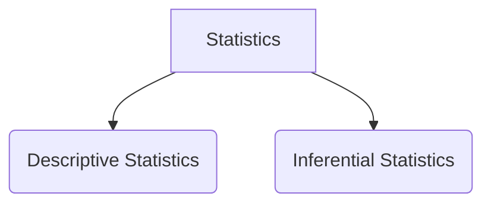
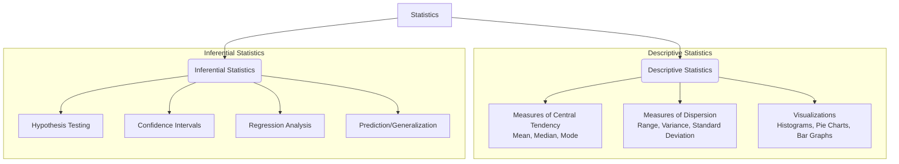
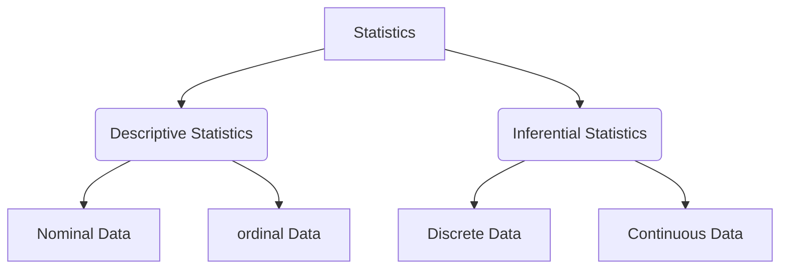

## 1. What is Statistics? (WHY it exists)

**Problem before:**
People had data but:

* too much data
* confusing
* no clear conclusion

**Statistics = solution**

**Definition:**
Statistics is the science of **collecting, organizing, analyzing, and interpreting data** to make decisions.

**Simple example:**
Marks of 100 students → too messy
Statistics → average mark, highest, lowest, trend

---

## 2. Types of Statistics

### 2.1 Descriptive Statistics (WHAT happened)

**Problem before:**
Raw data looked messy, no summary.

**Purpose:**
Describe data in a **simple form**.

**Examples:**

* Mean
* Median
* Tables
* Graphs

**Example:**
Average salary = ₹30,000

---

### 2.2 Inferential Statistics (WHAT will happen)

**Problem before:**
Cannot ask everyone (too costly, time-waste).

**Purpose:**
Use **small data** to predict **big data**.

**Example:**
Survey 100 voters → predict election result.

---

---

## 3. Population vs Sample

| Term       | Meaning                  | Why needed         |
| ---------- | ------------------------ | ------------------ |
| Population | Entire data              | Ideal but costly   |
| Sample     | Small part of population | Saves time & money |

**Example:**
Population → all Indians
Sample → 1,000 Indians surveyed

---

## 4. Types of Data

### 4.1 Categorical (Qualitative)

**Problem before:**
Text data had no structure.

#### (a) Nominal Data (No order)

**Example:**

* Gender: Male, Female
* Blood group: A, B, O

No ranking.

---

#### (b) Ordinal Data (Order exists)

**Example:**

* Education: 10th < 12th < Degree
* Ratings: Poor < Good < Excellent

Order matters, gap doesn’t.

---

### 4.2 Numerical (Quantitative)

#### (a) Discrete Data (Countable)

**Example:**

* Number of students = 10
* Number of cars = 3

Whole numbers only.

---

#### (b) Continuous Data (Measurable)

**Example:**

* Height = 165.5 cm
* Weight = 60.2 kg

Decimal values allowed.

---

## 5. Measures of Central Tendency

### 5.1 Mean (Average)

**Problem before:**
No single value to represent data.

**Formula:**
Mean = Sum of values / Number of values

**Example:**
Data: 10, 20, 30
Mean = (10+20+30)/3 = **20**

---

### 5.2 Median (Middle value)

**Why exists:**
Mean fails when data has **outliers**.

**Example:**
10, 20, 30 → Median = **20**

10, 20, 1000 → Median = **20**

---

### 5.3 Mode (Most frequent)

**Why exists:**
Useful for **categorical data**.

**Example:**
Shirt sizes: M, L, M, S → Mode = **M**

---

### 5.4 Weighted Mean

**Why exists:**
All values are **not equally important**.

**Formula:**
Weighted Mean = Σ(wx) / Σw

**Example:**

| Marks | Weight |
| ----- | ------ |
| 80    | 3      |
| 60    | 1      |

Weighted mean = (80×3 + 60×1)/(3+1) = **75**

---

### 5.5 Trimmed Mean

**Why exists:**
Remove extreme values.

**Example:**
Data: 10, 20, 30, 1000
Trim 1 from both sides → 20, 30
Mean = **25**

---

## 6. Measure of Dispersion (Spread)

### 6.1 Range

**Formula:**
Range = Max − Min

**Example:**
10, 20, 30 → Range = 30−10 = **20**

---

### 6.2 Variance

**Why exists:**
Mean alone hides variation.

**Idea:**
Average of squared deviations.

(No need to memorize formula now)

---

### 6.3 Standard Deviation (SD)

**Why exists:**
Variance is too large (squared units).

**SD = √Variance**

**Low SD:** data close
**High SD:** data spread out

---

### 6.4 Coefficient of Variation (CV)

**Why exists:**
Compare variability of different datasets.

**Formula:**
CV = (SD / Mean) × 100

---

## 7. Univariate Analysis (One variable)

### 7.1 Categorical Data – Frequency Table

**Example:**

| Gender | Frequency |
| ------ | --------- |
| Male   | 6         |
| Female | 4         |

---

### Cumulative Frequency

| Marks | Frequency | Cumulative |
| ----- | --------- | ---------- |
| 10    | 2         | 2          |
| 20    | 3         | 5          |
| 30    | 5         | 10         |

---

### 7.2 Numerical Data – Histogram

**Why exists:**
Table too boring → visual understanding.

Bars show **frequency range**.

---

## 8. Bivariate Analysis (Two variables)

### 8.1 Categorical – Categorical

**Example:**
Gender vs Passed (Yes/No)

**Graph:**
Bar chart / Stacked bar

---

### 8.2 Numerical – Numerical

**Example:**
Height vs Weight

**Graph:**
Scatter plot

Shows **relationship**.

---

### 8.3 Numerical – Categorical

**Example:**
Salary vs Department

**Graph:**
Box plot

---