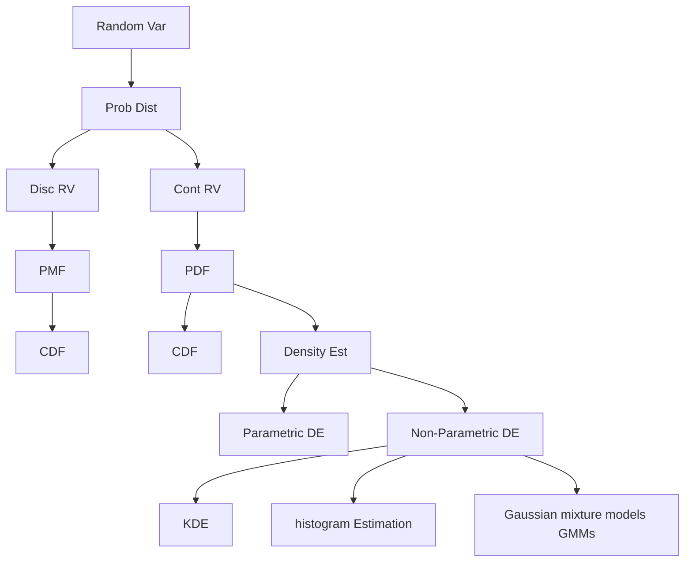
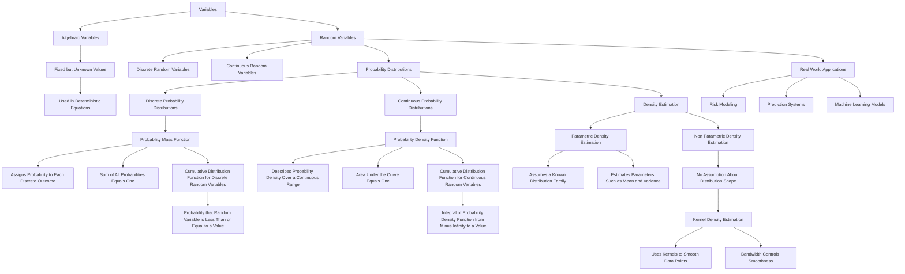
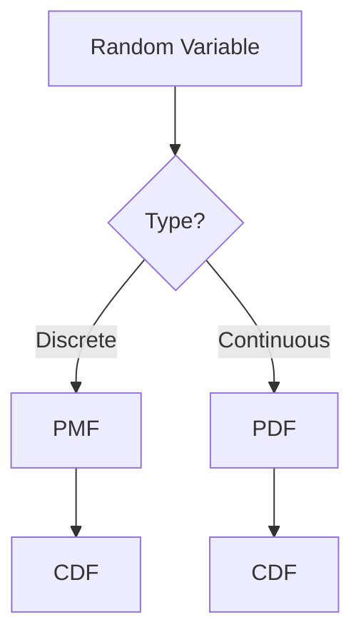
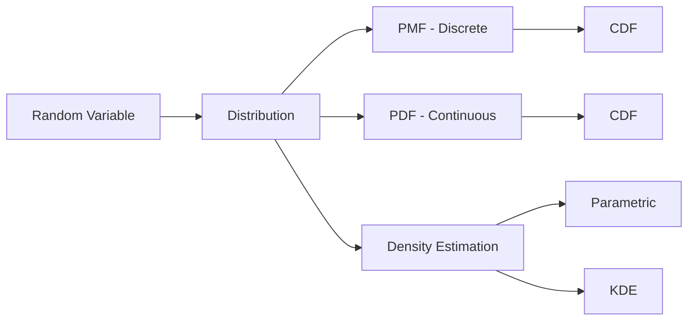

# 1. Variables (clear the confusion first)

## 1.1 Algebraic Variables

### What

A symbol representing a **fixed but unknown value**.

$$
x = 5,\quad y = 2x + 3
$$

### Why

Used in **equations**, not uncertainty.

### Example

If:

$$
x = 10
\Rightarrow y = 2(10) + 3 = 23
$$

👉 No randomness.

---

## 1.2 Random Variables (MOST IMPORTANT)

### What

A **function** that maps outcomes of a random experiment to numbers.


$$ X: \Omega \rightarrow \mathbb{R}$$

### Why needed

Real world is **uncertain**:

* dice
* stock prices
* rainfall
* clicks on ads

Random variable converts **uncertainty → numbers**.

---

### Example (Die 🎲)

Sample space:

$$ \Omega = {1,2,3,4,5,6} $$

Random variable:

$$
X = \text{number shown on die}
$$

---

## 1.3 Probability Variables ❌ (common mistake)

There is **no official concept** called *probability variable*.

Correct terms:

* **random variable**
* **probability distribution**

Probability is a **function**, not a variable.

---

# 2. Probability Distribution

## What

A rule that assigns **probability to values of a random variable**.

---

## Why we need it

**Problem without distribution:**

* Cannot quantify uncertainty
* Cannot compute expectation, risk, likelihood

**Distribution solves:**

* how likely each outcome is

---

## What it solves in data science

* model randomness
* build likelihoods
* estimate parameters
* train ML models

---

# 3. Types of Random Variables

## 3.1 Discrete Random Variable

### What

Takes **countable values**.

$$
X \in {x_1, x_2, x_3, \dots}
$$

### Examples

* die outcome
* number of customers
* number of defects

---

## 3.2 Continuous Random Variable

### What

Takes values from an **interval**.

$$
X \in [a,b]
$$

### Examples

* height
* time
* temperature

---

# 4. Probability Distribution Functions (Big Picture)



---

# 5. Probability Mass Function (PMF)

## What

Gives probability for **each discrete value**.

$$
P(X = x)
$$

---

## Why PMF exists

Discrete outcomes have **exact probabilities**.

---

## Die Example 🎲

### Outcomes (Set Format)

$$
\Omega = {1,2,3,4,5,6}
$$

Random variable:

$$
X = \text{die value}
$$

PMF:

$$
P(X = x) =
\begin{cases}
\frac{1}{6}, & x \in {1,2,3,4,5,6} \
0, & \text{otherwise}
\end{cases}
$$

---

### PMF Table

| x | P(X=x) |
| - | ------ |
| 1 | 1/6    |
| 2 | 1/6    |
| 3 | 1/6    |
| 4 | 1/6    |
| 5 | 1/6    |
| 6 | 1/6    |

---

### Python (PMF)

```python
import numpy as np

x = np.arange(1,7)
pmf = np.ones(6) / 6
```

---

# 6. CDF of PMF

## What

Probability that random variable is **≤ x**.

$$
F(x) = P(X \le x)
$$

---

## Die Example

[
F(3) = P(X \le 3) = \frac{3}{6} = 0.5
]

---

### CDF Table

| x | F(x) |
| - | ---- |
| 1 | 1/6  |
| 2 | 2/6  |
| 3 | 3/6  |
| 4 | 4/6  |
| 5 | 5/6  |
| 6 | 1    |

---

### Python (CDF)

```python
cdf = np.cumsum(pmf)
```

---

# 7. Probability Density Function (PDF)

## What

Describes **density** of probability for continuous variables.

$$
f(x)
$$

⚠️ Important:
$$
P(X = x) = 0
$$

Only **intervals** have probability.

---

## Why PDF exists

Continuous values are **infinite**, cannot assign exact probabilities.

---

## Example: Height

$$
P(170 \le X \le 175) = \int_{170}^{175} f(x),dx
$$

---

### Normal Distribution (Example PDF)

$$
f(x) = \frac{1}{\sqrt{2\pi\sigma^2}} e^{-\frac{(x-\mu)^2}{2\sigma^2}}
$$

---

### Python (PDF)

```python
from scipy.stats import norm

x = np.linspace(150, 190, 100)
pdf = norm.pdf(x, loc=170, scale=10)
```

---

# 8. CDF of PDF

## Definition

$$
F(x) = P(X \le x) = \int_{-\infty}^{x} f(t),dt
$$

---

### Python

```python
cdf = norm.cdf(x, loc=170, scale=10)
```

---

# 9. Density Estimation

## What

Estimate unknown **PDF** from data.

---

## Why we need it

**Real problem:**

* we don’t know true distribution
* data comes from unknown process

Density estimation helps:

* anomaly detection
* clustering
* generative models

---

# 10. Types of Density Estimation

## 10.1 Parametric Density Estimation

### Idea

Assume a distribution family.

$$
X \sim \mathcal{N}(\mu, \sigma^2)
$$

Estimate parameters:
$$
\hat{\mu}, \hat{\sigma}
$$

---

### Example

Assume heights are normal.

```python
mu_hat = np.mean(data)
sigma_hat = np.std(data)
```

---

## 10.2 Non-Parametric Density Estimation

### Why

Assumption may be wrong.

No fixed shape.

---

### Kernel Density Estimation (KDE)

$$
\hat{f}(x) = \frac{1}{nh} \sum_{i=1}^n K\left(\frac{x - x_i}{h}\right)
$$

* (K) → kernel (Gaussian)
* (h) → bandwidth (smoothness)

---

### Python (KDE)

```python
from sklearn.neighbors import KernelDensity

kde = KernelDensity(kernel='gaussian', bandwidth=1.0)
kde.fit(data.reshape(-1,1))
```

---

# 11. Big Mental Map 🧠



---

## Final Intuition (Data Science View)

* Random Variable → uncertainty in numbers
* PMF → exact probabilities
* PDF → probability density
* CDF → accumulation of probability
* Density Estimation → learn distribution from data

